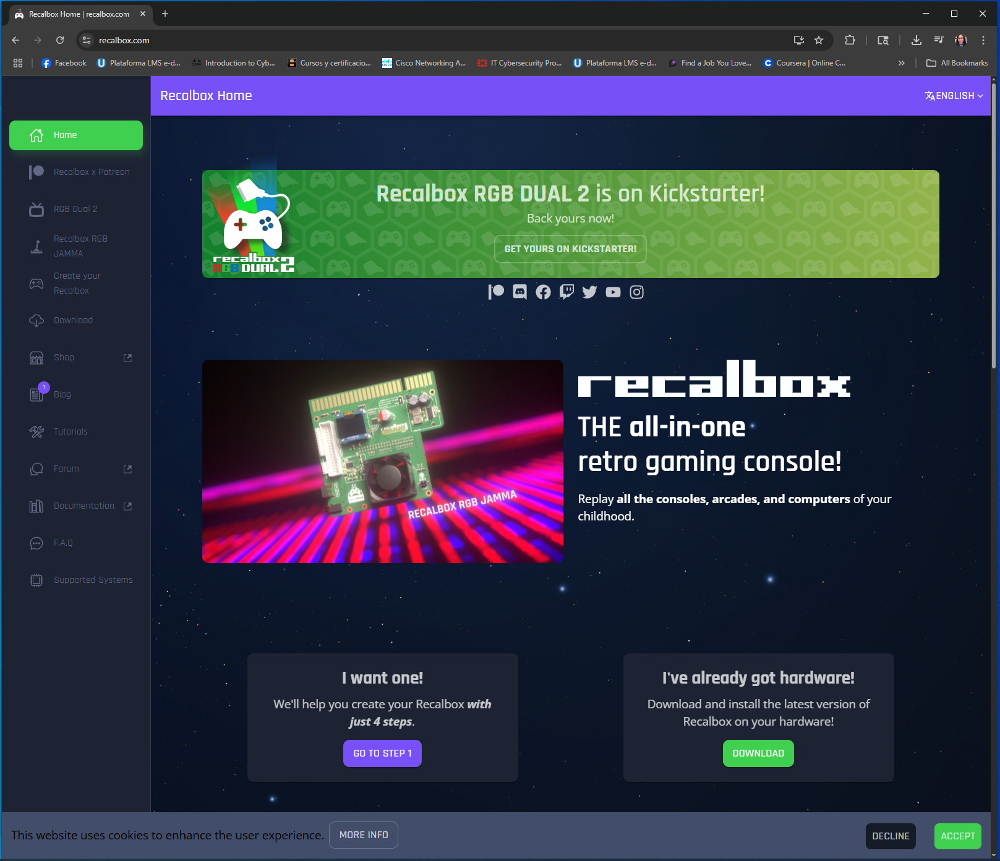
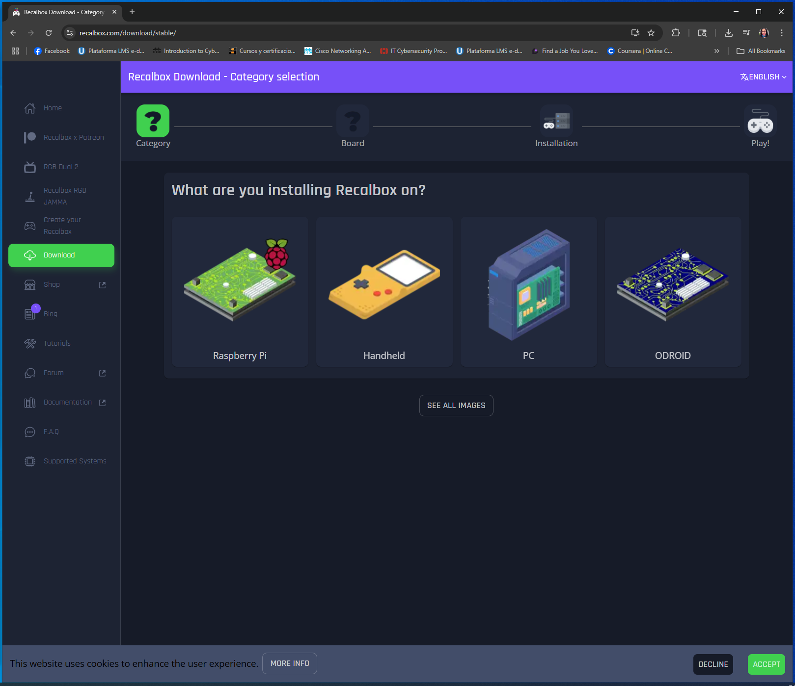
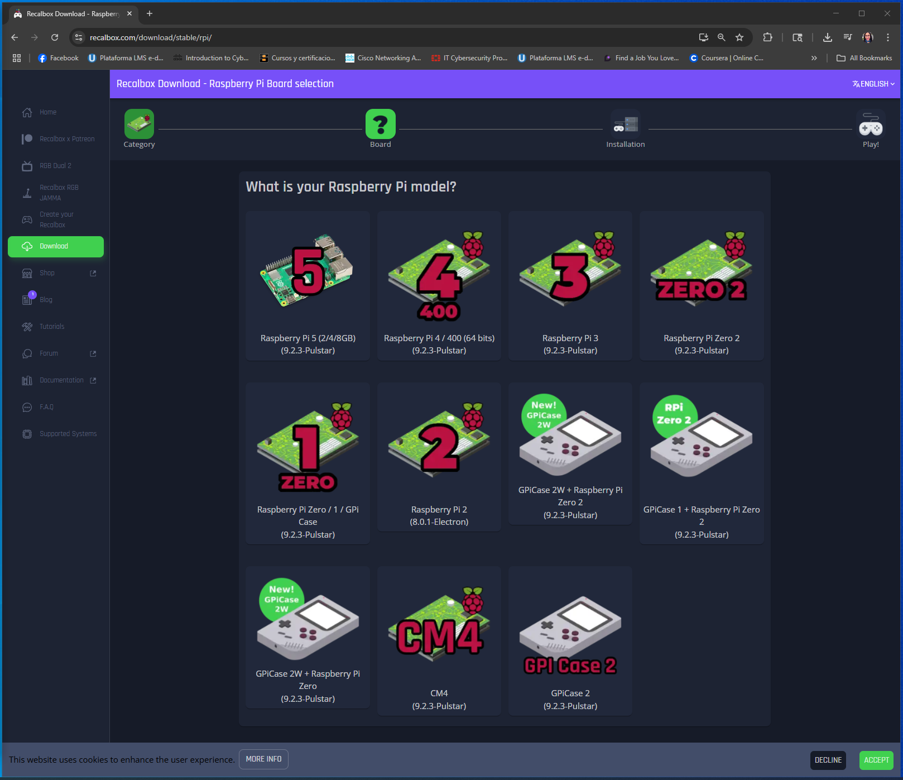
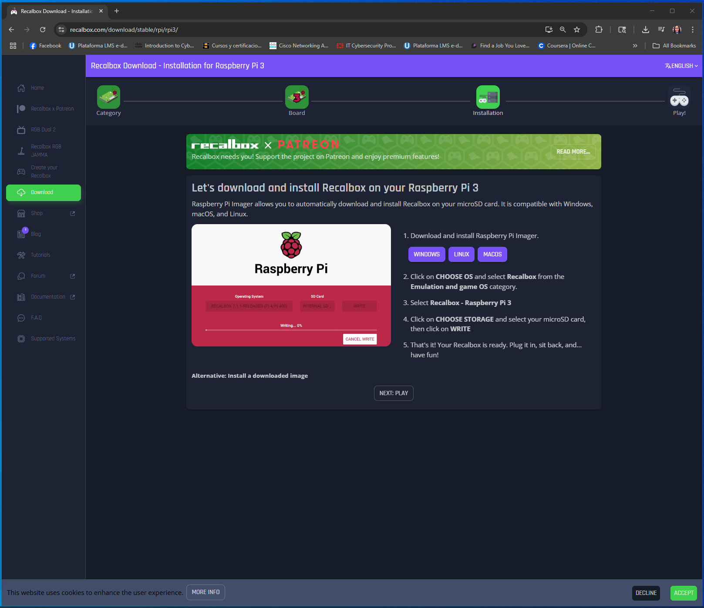
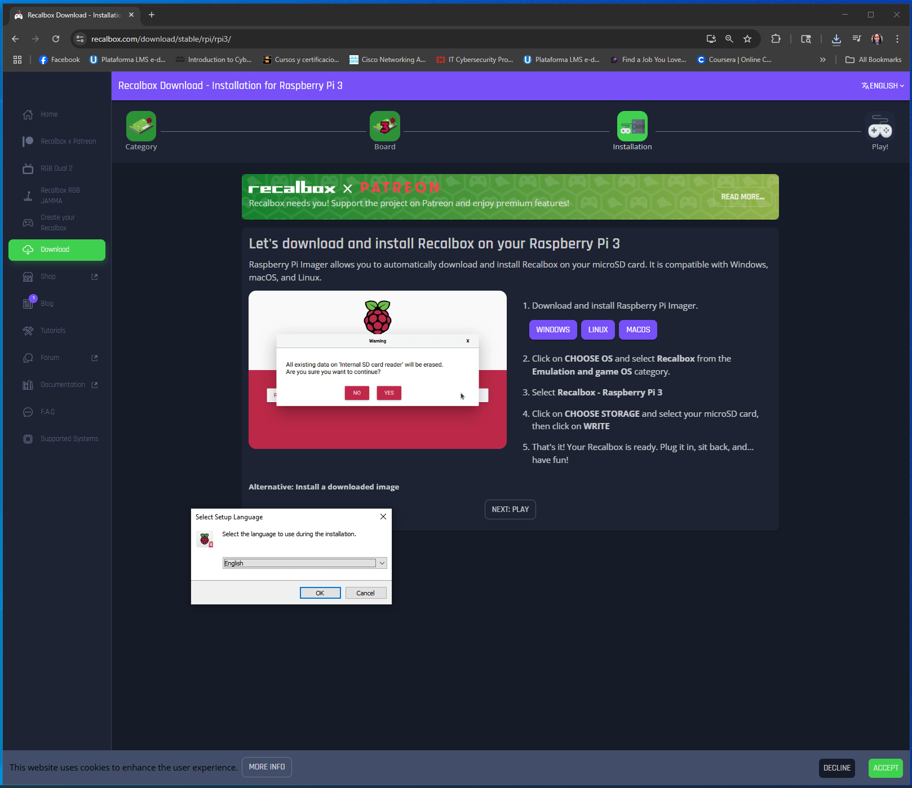

# 🎮 Retro-Game Rhapsody

Raspberry Pi + Recalbox. Turned a tiny board into a retro gaming console.

## Components needed
- Raspberry PI 3B
- Micro SD over 32gb
- Power Cable & HDMI cable. 

## What I learned

- Hardware setup and configuration
- Emulation and ROM management
- Power management and thermal design
- Troubleshooting and iteration

## Gallery 

## 🔧 Next Steps

- v2: Better cooling, custom enclosure, networked save states
- Explore other emulation platforms
- Document the full build process

## 🔗 Links

- [GitHub Repository](https://github.com/AstrointheCloud/Retro-Game-Rhapsody)
- [Website] [www.astrointhecloud.com ](https://astrointhecloud.com/)

